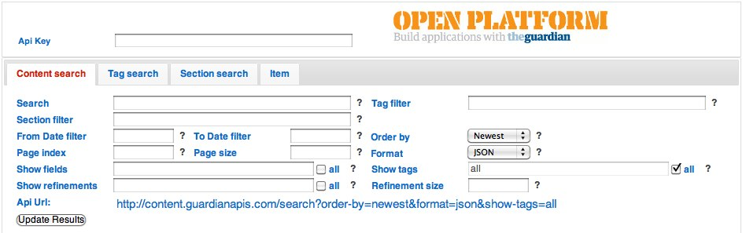
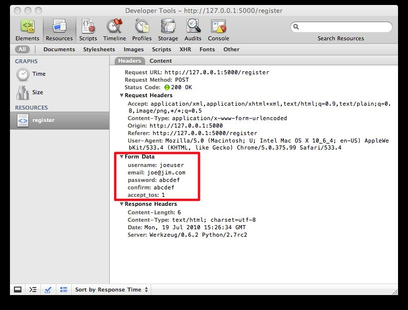
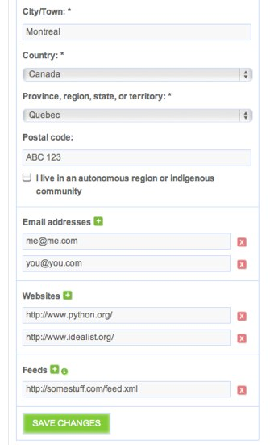
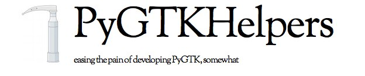

.. include:: <s5defs.txt>
===============================================
Form Processing with *Flatland*
===============================================

:author: **Scott Wilson**
:email: scott@idealist.org
:date: 21.07.2010

.. class:: center

    .. image:: images/idealist.gif

The Plan
========

- Quick statement of the problem
- The gory details on using flatland
- Some interesting applications and future directions

Forms?
======

|

.. class:: center

    .. image:: images/github.jpg

|

WebKit Inspector - Very Useful!
===============================

Form Processing?
================

`1. Type Conversion`

`2. Validation`

`3. Processing / Storage`

`4. Redisplay`

1. Type Conversion
========================

.. sourcecode:: python

  '1'          => 1
  '1999-12-31' => datetime.datetime(1999, 12, 31, 0, 0)
  'yes'        => True

2. Validation
========================

- `Was value type-converted successfully?`
- `Is date valid?`
- `Is page number > 0 ?`
- `Is email address in a valid format?`
- `Does a confirmation field match its pair?`

3. Processing / Storage
=======================

- `Trigger an API call`
- `Populate a model object and store it in a database`
- `Kick off some asynchronous processing.`
- `Generate a search result`
- `...`

4. Redisplay
============

- `Populate a form from model object or other data source`
- `Redisplay the submitted form data with validation feedback`

Other Related Tools
===================

- WTForms
- Django
- FormEncode
- FormBuilder
- Lots of others

What is Flatland?
=================

A schema-driven mapping toolkit providing:

- `Transformation of data between flat key-value representations and rich python data structures.`
- `Optional validation of the state of the form regardless of where the data originated.`
- `Declarative schema decription language`
- `Support for arbitrily complex structures`

Simple example
=========================================

.. sourcecode:: python

  from flatland import Dict, Float

  MySpot = Dict.of(
      Float.named('latitude'),
      Float.named('longitude')
  )

Simple example - Declarative
=========================================

.. sourcecode:: python

  from flatland import Float, Form

  class MySpot(Form):
      latitude = Float
      longitude = Float

|

**Form** is a sublcass of **Dict** that adds the declarative syntax.

*Note that the latitude and longitude properties of MySpot are ultimately removed.*

Setting values
==============

.. sourcecode:: python

  # By passing a dictionary to the constructor
  >>> el = MySpot({'latitude': 52.48, 'longitude': -1.89})
  >>> el
  {u'latitude': <Float u'latitude'; value=52.48>,
   u'longitude': <Float u'longitude'; value=-1.89>}

  # Check the native python value
  >>> el.value
  {u'latitude': 52.48, u'longitude': -1.89}

  # Set values on an existing instance using .set
  >>> el.set({'latitude': 1.0, 'longitude': -1.0})
  >>> el.value
  {u'latitude': 1.0, u'longitude': -1.0}

Flattening values
=================

.. sourcecode:: python

  >>> el = MySpot({'latitude': 52.48, 'longitude': -1.89})

  >>> el.flatten()
  [(u'latitude', u'52.480000'),
   (u'longitude', u'-1.890000')]

Setting values from objects
===========================

.. sourcecode:: python

  # Simple point object
  >>> Point = namedtuple('Point', 'latitude', 'longitude')
  >>> pt = Point(52.48, -1.89)

  # Construct using from_object factory method
  >>> el = MySpot.from_object(pt)

  # python value
  >>> el.value
  {u'latitude': 52.48, u'longitude': -1.89}

Default Values
===============

.. sourcecode:: python

  from datetime import datetime
  from flatland import Form, DateTime, Integer

  class GroceryList(Form):
      eggs = Integer.using(default=12)
      due = DateTime.using(default=datetime.now())

  # Construct using the from_defaults factory method
  >>> GroceryList.from_defaults().value
  {u'eggs': 12,
   u'due': datetime.datetime(2010, 7, 20, 23, 4, 0, 812918)}

To and From Flat
================

.. sourcecode:: python

  # Construct using the from_flat factory method
  >>> gl = GroceryList.from_flat(
          [('eggs', 9), ('due', '2010-07-20 23:04:00')]
      )

  # Native python value
  >>> gl.value
  {u'eggs': 9, u'due': datetime.datetime(2010, 7, 20, 23, 4)}

  # Flat value
  >>> gl.flatten()
  [(u'eggs', u'9'), (u'due', u'2010-07-20 23:04:00')]

Slice
=====

.. sourcecode:: python

  >>> gl = GroceryList({'eggs': 8, 'due': '1997-01-01'})

  # Only pull out eggs
  >>> gl.slice(['eggs'])
  {u'eggs': 8}

  # Omit due and rename eggs as huevos
  >>> gl.slice(omit=['due'], rename=[('eggs', 'huevos')])
  {'huevos': 8}

Elements
========

.. sourcecode:: python

    # Construct
    >>> Num = Integer.named('anumber')
    >>> Num(4)
    <Integer u'anumber'; value=4>

    # Get native python value
    >>> Num(4).value
    4

    # Get unicode value
    >>> Num(4).u
    u'4'

Elements - Work just like Forms
===============================

.. sourcecode:: python

    # Construct
    >>> Num.from_flat([('anumber', '4')])
    <Integer u'anumber'; value=4>

    # Flatten
    >>> Num(4).flatten()
    [(u'anumber', u'4')]

Scalar Element Types
=====================

- Boolean
- Date
- DateTime
- Decimal
- Enum
- Float
- Integer
- Long
- String
- Time

Container Element Types
========================

- Array
- Dict
- List
- MultiValue
- SparseDict

Compound Element Types
=======================

- DateYYYYMMDD
- JoinedString
- ... so far

Validation - Converted
======================

.. sourcecode:: python

    >>> from flatland import Integer
    >>> from flatland.validation import Converted

    # With an input that can be coerced to an integer
    >>> nn = Integer('123')
    >>> Converted().validate(nn, {})
    True

    # With an input that *cannot* be coerced to an integer
    >>> nn = Integer('abc')
    >>> Converted().validate(nn, {})
    False
    >>> nn.errors
    [u'None is not correct.']

Validation - Present
====================

.. sourcecode:: python

    >>> from flatland import Integer
    >>> from flatland.validation import Present

    # Present validates on any value (e.g. an invalid email address)
    >>> nn = Integer('abc')
    >>> Present().validate(nn, {})
    True

    >>> nn = Integer.named('quantity')()
    >>> Present().validate(nn, {})
    False
    >>> nn.errors
    ['quantity may not be blank.']

Validation - optional flag
==============================================

.. sourcecode:: python

    >>> from flatland import Integer
    >>> from flatland.validation import Present

    # With optional=False (default)
    >>> MyInt = Integer.validated_by(Present())\
                       .using(optional=False)
    >>> MyInt().validate()
    False

    # With optional=True
    # validators are not evaluated when value == None
    >>> MyInt = Integer.validated_by(Present())\
                       .using(optional=True)
    >>> MyInt().validate()
    True

Validation - Error Messges
==========================

.. sourcecode:: python

    >>> nn = Integer()
    # Override the error message for the
    # *missing* failure mode in the constructor.
    # Some validators encapsulate multiple
    # failure modes.
    >>> Present(missing='Where is it??').validate(nn, {})
    False
    >>> nn.errors
    ['Where is it??']

Validators - Scalars
==========================

- ValueBetwen
- LengthBetween
- ValueGreaterThan
- ValuesEqual
- IsTrue
- IsFalse
- IsEmail
- URLValidator
- ...

Validators - Container
========================

- HasAtLeast
- HasAtMost
- NotDuplicated

Custom Validator
================

.. sourcecode:: python

    class ValidWikiName(Validator):
        fail = N_('A wiki name is only valid when the ...')

        name_re = re.compile('^[A-Z][a-z]\w*$')

        def validate(self, element, state):
            if not self.name_re.match(element.u):
                return self.note_error(element, state, 'fail')
            return True

Validation Example - On Form
==============================

.. inline-demo:: demo/passwords-form
   :width: 350
   :height: 400
   :float: right

.. sourcecode:: python

    class PasswordCompareForm(Form):
        password = String.using(
            label='New Password',
            validators=[
                Present(),
                LengthBetween(5, 25)
            ])
        confirm = String.using(
            label='Repeat Password',
            validators=[Present()]
        )
        validators = [
            ValuesEqual(
                'password',
                'confirm'
            )
        ]

Validation Example - On Element
================================

.. inline-demo:: demo/passwords-element
   :width: 350
   :height: 400
   :float: right

.. sourcecode:: python

    class PasswordCompareElement(Form):
        password = String.using(
            label='New Password',
            validators=[
                Present(),
                LengthBetween(5, 25)
            ]
        )
        confirm = String.using(
            label='Repeat Password',
            validators=[
                Present(),
                ValuesEqual(
                    '.',
                    '../password'
                )]
        )

Nested Structure
================

.. sourcecode:: python

    class ContactForm(Form):
        name = String.validated_by(Present())
        addresses = List.of(
            Dict.of(
                String.named('street'),
                String.named('city'),
                String.named('country'),
                List.named('phone_numbers').of(
                    Dict.of(
                        String.named('label'),
                        String.named('number')
                    )
                ).using(default=1)
            )
        ).using(default=1)

Nested Structure - Nested Forms
===============================

.. sourcecode:: python

    class PhoneNumber(Form):
        label = String
        number = String

    class Address(Form):
        street = String
        city = String
        country = String
        phone_numbers = List.of(PhoneNumber
                                ).using(default=1)

    class ContactForm(Form):
        name = String.validated_by(Present())
        addresses = List.of(Address.using(default=1))

Path Lookup
===========

.. sourcecode:: python

    form.find('/name')

    form.find('addresses[0]')

    form.find('addresses[0]/phone_numbers[0]/number')

Flattening Nested Structures
============================

.. sourcecode:: python

    >>> el = ContactForm(value=dict(name='John'))
    >>> el.flatten()
    [(u'name', u'John')]

    >>> el['addresses'] = [{'street': '123 Bay St.',
                            'city':   'Toronto',
                            'country': 'CA',
                            'phone_numbers': []}]

    >>> el.flatten()
    [(u'name', u'John'),
     (u'addresses_0_street', u'123 Bay St.'),
     (u'addresses_0_city', u'Toronto'),
     (u'addresses_0_country', u'CA')]

Defaults factory for Nested Schema
===================================

- Useful when populating a template rendering context for a clean web form

.. sourcecode:: python

    >>> el.ContactForm.from_defaults()
    >>> el.flatten()
    [(u'name', u''), (u'addresses_0_city', u''),
    (u'addresses_0_street', u''),
    (u'addresses_0_country', u''),
    (u'addresses_0_phone_numbers_0_number', u''),
    (u'addresses_0_phone_numbers_0_label', u'')]

Output Generation
=================

.. sourcecode:: python

    >>> from flatland import String
    >>> from flatland.out.markup import Generator

    >>> field = String.named('eggs')('brown')
    # Construct a markup generator
    >>> gen = Generator()

    # Render field as an input tag
    >>> gen.input(field)
    u'<input name="eggs" value="brown" />'

    # Generate dom ids when rendering
    >>> gen['auto_domid'] = True
    >>> gen.input(field)
    u'<input name="eggs" value="brown" id="f_eggs" />'

Output Generation - Labels
==========================

.. sourcecode:: python

    >>> field = String.named('eggs')('brown')
    >>> gen = Generator(auto_for=True)

    # Render explicit open ...
    >>> gen.label.open(field)
    u'<label for="f_eggs">'

    >>> gen.input(field)
    u'<input name="eggs" value="brown" />'

    # ... and close tags for wrapping tags
    # (e.g. label, form, textarea)
    >>> gen.label.close()
    u'</label>'

Output Generation - tabindex
============================

.. sourcecode:: python

    >>> field = String.named('eggs')('brown')
    >>> gen = Generator(auto_tabindex=True, tabindex=1)

    >>> gen.input(field)
    u'<input name="eggs" value="brown" tabindex="1" />'

    >>> gen.input(field)
    u'<input name="eggs" value="brown" tabindex="2" />'

Output Generation Options
=========================

.. sourcecode:: python

    >>> Generator()
    Generator({
        u'auto_filter': False,
        u'markup_wrapper': <class 'flatland.out.generic.Markup'>,
        u'auto_domid': False,
        u'ordered_attributes': True,
        u'auto_name': True,
        u'auto_tabindex': False,
        u'auto_for': False,
        u'filters': (),
        u'auto_value': True,
        u'tabindex': 0,
        u'domid_format': u'f_%s'})

Output filters
==============

.. sourcecode:: python

    from flatland import Integer
    from flatland.out.markup import Generator

    def error_filter(tagname, attrs, contents,
                     context, bind):
        """When we encounter a bind element
           having errors, set the rendered
           tag's class property to 'error'."""
        if bind is not None and bind.errors:
            attrs['class'] = 'error'
        return contents
    # Bind error_filter to input tags generation
    error_filter.tags = ('input',)

Output filters - cont'd
=======================

.. sourcecode:: python

    gen = Generator(auto_filter=True,
                    filters=[error_filter])

    >>> num = Integer.validated_by(Converted())('abc')
    >>> num.validate()
    False
    >>> num.errors
    [u'None is not correct.']

    >>> gen.input(num)
    u'<input value="abc" class="error" />'

Output Generation - Jinja2
==========================

.. sourcecode:: python

    from flatland.out.markup import Generator
    from jinja2 import Markup
    gen = Generator(markup_wrapper=Markup)
    return render_template('password.html',
                           form=form, generator=gen)

.. sourcecode:: html+jinja

  <dt>
    {{ gen.label.open(field) }}
    {{ field.label }}
    {{ gen.label.close() }}
  </dt>
  <dd>
    {{ gen.input(field) }}
  </dd>

Output Generation - Jinja2 (cont'd)
===================================

.. sourcecode:: html+jinja

    
      
        <ul class="error">
          
            <li>{{ error }}</li>
          
        </ul>
      
    

-------

An Extension in progress to easy integration of flatland with flask.

Genshi Output - Template
==========================

.. sourcecode:: html+genshi

    <form xmlns="http://www.w3.org/1999/xhtml"
          xmlns:py="http://genshi.edgewall.org/"
          xmlns:form="http://ns.discorporate.us/flatland/genshi"
          form:bind="form">
      <form:with auto_domid="on" auto_for="on">
        <label py:with="el=form.password" form:bind="el">
          ${el.label}: <input form:bind="el" />
        </label>

        <label py:with="el=form.confirm" form:bind="el">
          ${el.label}: <input form:bind="el" />
        </label>

        <button value="Submit" />
      </form:with>
    </form>

Genshi Output - Result
===================================

.. sourcecode:: html+genshi

    <form xmlns="http://www.w3.org/1999/xhtml">
        <label for="f_password">
          New Password:
          <input name="password" value="" id="f_password" />
        </label>
        <label for="f_confirm">
          Repeat Password:
          <input name="confirm" value="" id="f_confirm" />
        </label>
        <button value="Submit"></button>
    </form>

Genshi Output - Code
==========================

.. sourcecode:: python

    from genshi.template import MarkupTemplate
    from flatland.out.genshi_06 import setup

    template = MarkupTemplate(markup)
    setup(template)

    kw = {'form': PasswordCompareForm() }
    output = template.generate(**kw).render('xhtml')

Idealist example
================

Compound field example
=======================

.. sourcecode:: python

    class Location(Compound):
        levels = ['country', 'state', 'city', 'street_address', 'postal_code']

        def __compound_init__(cls):
            cls.field_schema = [
                Country.using(name='country',
                              label=N_('Country'),
                              optional=optional[0],
                              validators=[
                                  Present(),
                                  Converted()]),
                State.using(name='state',
                            label=N_('Province, region, state, or territory'),
                            optional=optional[1],
                            validators=[
                                ValidState()]),
                String.using(name='city',
                             label=N_('City/Town'),
                             optional=optional[2],
                             validators=[
                                 Present(),
                                 NoLongerThan(255)]),

Compound Field cont'd
=====================

.. sourcecode:: python

    def compose(self):
        """Emits an AssetAddress object."""
        aa = AssetAddress()
        self.update_object(aa, omit='autonomous')
        return "", aa

    def explode(self, value):
        """Consumes an AssetAddress object."""
        if value is None:
            return

        for field in self.levels:
            self[field] = getattr(value, field)
        if value.id:
            self['id'] = value.id

Other applications
==================

- `REST Service`
- `JSON`
- `Config validation`
- `argv`
- `Cookies`
- `noSQL`

API with multiple inputs
========================

Idealist Postgresql / HSTORE
============================

Custom SQLAlchemy column type

- Serializes data structures into queryable / indexable key-value store.
- Allows non-critical aspects of the schema to evolve over time with
  minimal obstacles and migration headaches.
- Allows us to store a whole series of *mostly* identical object types
  in a single table.
- Primarily concerned with type conversion and marshalling, less so
  with validation.
- Duck typing
- Sparse storage.

Idealist Skeleton Schema
========================

.. sourcecode:: python

    # Generated from a more PM friendly format
    ContentProperties = flatland.SparseDict.of(
      flatland.String.named("access"
          ).validated_by(converted).using(optional=True),
      flatland.String.named("access_other"
          ).validated_by(converted).using(optional=True),
      flatland.DateTime.named("attendee_registration_end_date"
          ).validated_by(converted).using(optional=True),
      flatland.DateTime.named("attendee_registration_start_date"
          ).validated_by(converted).using(optional=True),
      NullableBoolean.named("can_bring_guests"
          ).validated_by(converted).using(optional=True),
      flatland.Integer.named("cost"
          ).validated_by(converted).using(optional=True),
    )

Idealist Preference Schema
===========================

.. sourcecode:: python

    class PreferenceSchema(Form):
        """Flatland schema describing preferences. """

        # Setting policy to 'duck' tells the form
        # to set values for any subset of input
        # keys that match the schema while ignoring
        # those that don't.
        policy = 'duck'

Idealist Preferences Extract
==================================

.. sourcecode:: python

    class UserPreferenceSchema(PreferenceSchema):
        profile = Dict.of(
            Enum.named('visibility').valued(
                'any', 'connected', 'member', 'none'
            ).using(
                default='member', label=N_('Who can see my profile')
            ))

        communication = Dict.of(
            Boolean.named('html_email').using(
                default=True, true=u'on', false=u'off',
                label=N_('Receive email in HTML format.')),
            Boolean.named('do_not_mail').using(
                default=False, true=u'on', false=u'off',
                label=N_('Do not send any email.')),
        )

xodb
====

|

Xapian object database for Python.

Object schema and transformation rules defined using extended
flatland elements.

- Prefixed or unprefixed
- To facet or not to facet?

xodb - Imagine a model class
=============================

|

.. sourcecode:: python

  class Department(object):

      def __init__(self, name, employees):
          self.name = name
          self.employees = employees

xodb - Create a Schema
======================

|

.. sourcecode:: python

  from xodb import Schema, String, Array

  class DepartmentSchema(Schema):
      language = String.using(default="en")
      name = String.using(facet=True)
      employees = Array.of(
          String.using(facet=True)
      )

xodb - Associate
================

Create an index and associate schema to model class:

.. sourcecode:: python

  import xodb
  db = xodb.temp()
  db.map(Department, DepartmentSchema)

xodb - Flatten
==============

Now, create some departments:

.. sourcecode:: python

  housing = Department("housing", ['bob', 'jane'])
  monkeys = Department("monkeys", ['bob', 'rick'])

and add them to the database:

.. sourcecode:: python

  db.add(housing, monkeys)
  db.backend.flush()

xodb - Retrieve
===============

|

.. sourcecode:: python

  assert db.query("name:monkeys"
                 ).next().name == "monkeys"

.. sourcecode:: python

  assert db.query("employees:jane"
                 ).next().name == "housing"

xodb - For more information
===========================

:author: Michel Pelletier
:website: http://bitbucket.org/pelletier_michel/xodb

PyGTKHelpers
============

|

-------

Uses flatland for form schema definition and validation of input forms in PyGTK apps.

-------

.. [1] http://packages.python.org/pygtkhelpers

PyGTKHelpers - Schema
=====================

.. sourcecode:: python

    from flatland import Form, String, Integer, Boolean
    from flatland.validation import ValueBetween

    class PersonSchema(Form):
        name = String
        age = Integer.validated_by(
            ValueBetween(minimum=18, maximum=120)
        )
        weight = Integer.validated_by(
            ValueBetween(minimum=0, maximum=300)
        )
        weight.render_options = dict(
            style='slider'
        )
        friendly = Boolean

PyGTKHelpers - Form
=====================

.. sourcecode:: python

    from pygtkhelpers.forms import FormView

    class PersonView(FormView):
        schema_type = PersonSchema

    if __name__ == '__main__':
        PersonView().show_and_run()

----------------

.. image:: images/simpleform.png

-------

.. [2] http://packages.python.org/pygtkhelpers/api_forms.html

PyGTKHelpers
============

For details:
http://packages.python.org/pygtkhelpers
http://packages.python.org/pygtkhelpers/api_forms.html

For more on flatland
====================

:author: Jason Kirtland
:website: http://discorporate.us/projects/flatland/

Dinner Time!
============

Thanks!
=======

| Scott Wilson
| scott@idealist.org
| @swidealist

| Slides available for viewing at:  http://rswilson.ch/flatland/
| Github repository at: http://github.com/scooterXL/flatland-europython-2010

.. footer:: Europython 2010, Birmingham - http://discorporate.us/projects/flatland/

